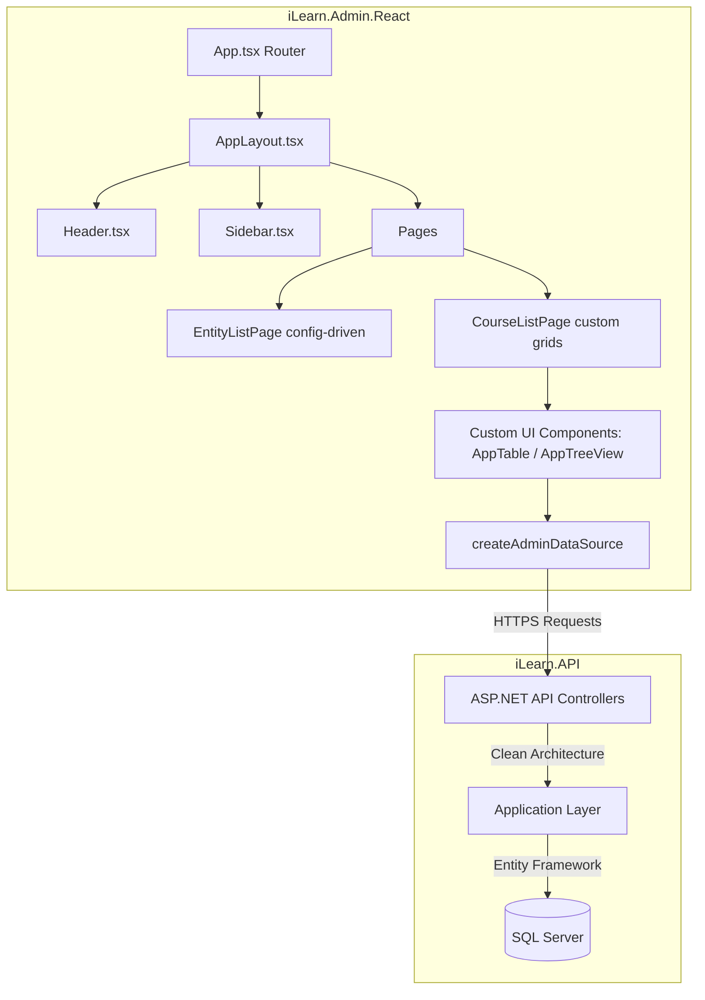

# รายงานการสำรวจและเปรียบเทียบฟังก์ชันระบบ (Functional Audit & Comparison Report)
## iLearn.Admin (MVC) vs iLearn.Admin.React (SPA)

รายงานฉบับนี้จัดทำขึ้นเพื่อบันทึกการวิเคราะห์และสำรวจฟังก์ชันการทำงาน เปรียบเทียบสถาปัตยกรรมซอฟต์แวร์ระหว่างระบบบริหารจัดการเรียนรู้ตัวเดิม (**iLearn.Admin - ASP.NET Core MVC**) และระบบตัวใหม่ (**iLearn.Admin.React - Vite + React SPA**) เพื่อใช้เป็นแนวทางและหลักฐานอ้างอิงในการเริ่มทดสอบระบบจริง (Go-Live / UAT)

---

## 🏗️ โครงสร้างการเชื่อมต่อระบบตัวใหม่ (Client-Server Flow)

ระบบใหม่ได้รับการออกแบบตามสถาปัตยกรรมแบบแยกหน้าบ้านและหลังบ้านอย่างอิสระ (Decoupled Architecture) เพื่อประสิทธิภาพการทำงานสูงสุด:


---

## 📊 ตารางเปรียบเทียบฟังก์ชันและรูปแบบ UI (Side-by-Side Function & UI Audit)

| ลำดับ | ฟังก์ชันการทำงานหลัก | 🔴 iLearn.Admin ตัวเก่า (ASP.NET MVC) | 🟢 iLearn.Admin.React ตัวใหม่ (Vite + React) | 🎨 รูปแบบ UI ที่ใช้ (UI Pattern) |
| :---: | :--- | :--- | :--- | :--- |
| 1 | **แดชบอร์ดหลัก (Dashboard)** | `HomeController.cs` -> `Index.cshtml` | `DashboardPage.tsx` | **Dashboard Grid (Metrics Cards + Charts)** |
| 2 | **รายการหลักสูตร (Courses List)** | `CoursesController.cs` -> `Index.cshtml` | `CourseListPage.tsx` | **Split Layout (Category Tree + Grid Table)** |
| 3 | **ฟอร์มสร้าง/แก้ไขคอร์ส (Course Editor)**| `CoursesController.cs` -> `Editor.cshtml` | `CourseEditorPage.tsx` | **AppWizard (Multi-step) + Selection Popups** |
| 4 | **หน้ารายละเอียดคอร์ส (Course Detail)** | `CoursesController.cs` -> `Detail.cshtml` | `CourseDetailPage.tsx` | **Detail Surface / Tabs Layout** |
| 5 | **ฟอร์มจัดการเวอร์ชันคอร์ส (Version Form)**| `CoursesController.cs` -> `VersionForm.cshtml` | `VersionFormPage.tsx` | **AppWizard (Multi-step) + Library Picker Popup** |
| 6 | **คลังเนื้อหาบทเรียน (Content Library)** | `ContentItemsController.cs` -> `Index.cshtml` | `EntityListPage.tsx` (ผ่าน `moduleConfigs.ts`) | **Config-Driven Grid Table (AppTable)** |
| 7 | **รายละเอียดบทเรียน (Content Detail)** | `ContentItemsController.cs` -> `Detail.cshtml` | `ContentItemDetailPage.tsx` | **Detail Surface / Action Controls** |
| 8 | **แก้ไขรายละเอียดบทเรียน (Content Edit)** | `ContentItemsController.cs` -> `Editor.cshtml` (ถ้ามี) | `ContentItemEditorPage.tsx` | **AppWizard (Multi-step Wizard)** |
| 9 | **รายการชุดคำสั่งมอบหมาย (Assignments)** | `AssignmentsController.cs` -> `Index.cshtml` | `EntityListPage.tsx` (ผ่าน `moduleConfigs.ts`) | **Config-Driven Grid Table (AppTable)** |
| 10 | **มอบหมายงานกลุ่มใหญ่ (Bulk Assign)** | `AssignmentsController.cs` -> `BulkAssign.cshtml` | `BulkAssignPage.tsx` | **AppWizard (Multi-step) + Selection Lists** |
| 11 | **รายละเอียดการมอบหมาย (Assign Detail)** | `AssignmentsController.cs` -> `Detail.cshtml` | `AssignmentDetailPage.tsx` | **Detail Surface + Extend Due Date Popup** |
| 12 | **รายงานผู้เรียนและการบ้าน (Report)** | `AssignmentsController.cs` -> `Report.cshtml` | `AssignmentReportPage.tsx` | **Analytical Grid + Summary Metrics Cards** |
| 13 | **แผนภูมิแกนต์มอบหมาย (Gantt Chart)** | `AssignmentsController.cs` -> `Gantt.cshtml` | `AssignmentGanttPage.tsx` | **Bespoke Interactive Gantt Timeline** |
| 14 | **ระบบจัดการกลุ่มผู้เรียน (Learner Groups)**| `LearnerGroupsController.cs` -> `Index.cshtml` | `EntityListPage.tsx` (ผ่าน `moduleConfigs.ts`) | **Config-Driven Grid Table (AppTable)** |
| 15 | **รายละเอียดกลุ่มพนักงาน (Group Detail)** | `LearnerGroupsController.cs` -> `Detail.cshtml` | `LearnerGroupDetailPage.tsx` | **Detail Surface + Centered Picker & Removal Modals** |
| 16 | **หน้าแก้ไขกลุ่มพนักงาน (Group Editor)** | `LearnerGroupsController.cs` -> `Editor.cshtml` | `LearnerGroupEditorPage.tsx` | **AppWizard (Multi-step Wizard)** |
| 17 | **ทำเนียบพนักงาน (Learners Directory)** | `LearnersController.cs` -> `Index.cshtml` | `EntityListPage.tsx` (ผ่าน `moduleConfigs.ts`) | **Config-Driven Grid Table (AppTable)** |
| 18 | **ประวัติการเรียนส่วนบุคคล (Profile)** | `LearnersController.cs` -> `Profile.cshtml` | `LearnerProfilePage.tsx` | **Tabbed User Profile + Performance Metrics** |
| 19 | **ประวัติประเมินผลการเรียน (Logs)** | `LearningLogsController.cs` -> `Index.cshtml` | `EntityListPage.tsx` (ผ่าน `moduleConfigs.ts`) | **Config-Driven Grid Table (AppTable)** |
| 20 | **จัดการผู้ดูแลระบบ (Admin Users)** | `UsersController.cs` -> `Index.cshtml` | `AdminUsersPage.tsx` | **Custom Grid (AppTable) + Action Modals** |
| 21 | **ข้อมูลโครงสร้างองค์กร (Divisions)** | `DivisionsController.cs` -> `Index.cshtml` | `EntityListPage.tsx` (ผ่าน `moduleConfigs.ts`) | **Read-Only Grid Table + Sub-Details Page CRUD** |
| 22 | **ข้อมูลการตั้งค่าระบบ (System Config)** | `SystemConfigController.cs` -> `Index.cshtml` | `SystemConfigPage.tsx` | **Grid Info Surface + Cache Action Buttons** |

---

## 🎨 เจาะลึกรูปแบบ UI ดีไซน์ในแอปพลิเคชัน (Core UI Patterns Analysis)

จากการสำรวจโครงสร้างและคลาส CSS ในระบบเวอร์ชัน React พบว่ามีการเลือกใช้รูปแบบดีไซน์และพฤติกรรม UI (UX Behavior) ออกเป็น 5 รูปแบบหลัก เพื่อให้สอดคล้องกับพฤติกรรมของผู้ใช้ระดับผู้ดูแลระบบ (Admin) ดังนี้:

### 1. รูปแบบตัวนำทางตามขั้นตอน (AppWizard - Multi-Step Wizard)
แอปพลิเคชันเลือกใช้คอมโพเนนต์ส่วนกลางชื่อ `<AppWizard />` (ตรวจสอบได้จากการใช้คลาสทางกายภาพ `.wizard-surface`) ในการสร้างหรือแก้ไขข้อมูลที่มีความซับซ้อนสูง:
* **ฟังก์ชันที่ใช้:** `CourseEditorPage` (แก้ไขคอร์ส), `VersionFormPage` (จัดการเวอร์ชัน), `ContentItemEditorPage` (แก้ไขบทเรียน), `LearnerGroupEditorPage` (แก้ไขกลุ่มผู้เรียน), `BulkAssignPage` (มอบหมายกลุ่มใหญ่)
* **พฤติกรรม UI:** จะทำการซ่อน/แสดงฟิลด์ข้อมูลออกเป็นหน้าย่อยๆ (เช่น ข้อมูลทั่วไป -> เลือกบทเรียน -> ตั้งค่าสิทธิ์ -> ยืนยัน) มีตัวคุม Step Indicator ด้านบน และปุ่ม Next/Back/Save ด้านล่าง ทำให้หน้าจอไม่รกและผู้ใช้ไม่สับสนเวลาต้องใส่ข้อมูลจำนวนมาก

### 2. รูปแบบหน้าต่างป๊อปอัพลอยตัว (Backdrop-Blurred Modal / Popup)
ใช้สำหรับการเลือกข้อมูลเสริมหรือยืนยันคำสั่งที่เร่งด่วน โดยไม่ต้องเปลี่ยนหน้าจอหลัก:
* **ฟังก์ชันที่ใช้:** 
  * `CourseEditorPage` & `VersionFormPage` : **Library Picker Modal Overlay** (ป๊อปอัพเลือก SCORM Package จากคลังเพื่อนำมาผูกกับบทเรียน)
  * `AssignmentDetailPage` : **Extend Due Date Modal** (ป๊อปอัพเลื่อนกำหนดส่งงานด่วน)
* **พฤติกรรม UI:** จะมีแผ่นหลังมืดโปร่งแสงพร้อมเบลอฉากหลัง (`bg-black/40 backdrop-blur-xs`) และตัวหน้าต่างป๊อปอัพลอยตัวขึ้นมาแบบมีมิติเคลื่อนไหว (`animate-scale-in`) ปิดได้โดยกดปุ่มกากบาทหรือคลิกนอกพื้นที่หน้าต่าง

### 3. รูปแบบลิ้นชักสไลด์ข้าง (Overlay Drawer / Side Panel) - *ยกเลิกการใช้งานแล้ว*
* **ประวัติการปรับปรุง:** ระบบได้ทำการยกเลิกการใช้ลิ้นชักสไลด์ข้าง (Overlay Drawer) ในทุกหน้าเรียบร้อยแล้ว โดยฟังก์ชันเดิม เช่น การเพิ่มผู้เรียนเข้ารหัสคำสั่งมอบหมาย (Add Learners ในหน้า `AssignmentDetailPage`) และการพรีวิวผลกระทบก่อนยืนยันการลบสมาชิก (Remove Members Preview ในหน้า `LearnerGroupDetailPage`) ได้รับการปรับย้ายไปทำงานในรูปแบบ **หน้าต่างป๊อปอัพลอยตัวกึ่งกลางจอ (Centered Backdrop-Blurred Modals)** ซึ่งให้ความหรูหรา สวยงาม และรองรับการทำงานบนหน้าจอมือถือได้อย่างสมบูรณ์แบบ

### 4. รูปแบบตารางแก้ไขข้อมูลแถวตรง (Inline CRUD Grid Table) - *ยกเลิกการใช้งานแล้ว*
* **ประวัติการปรับปรุง:** ได้รับการยกเลิกการแก้ไขในตารางโดยตรง (ทั้งในรูปแบบ Inline Row Inputs และตาราง CRUD Popups) ทั้งหมด สำหรับหมวดหมู่ข้อมูลพื้นฐาน (Divisions, Categories, Course Types, Roles) โดยปรับไปสู่สถาปัตยกรรม **Read-Only Grid Table + Details Sub-Pages** ซึ่งเมื่อผู้ใช้ดับเบิลคลิกแถวตารางหรือกดปุ่มดูรายละเอียด ระบบจะนำทางเข้าสู่หน้ารายละเอียดและฟอร์มแก้ไขแยกต่างหาก (`/master-data/:type/:id`) เพื่อป้องกันการกรอกข้อมูลผิดพลาดและการกดปุ่มพลาดในระดับตาราง

### 5. รูปแบบเลย์เอาต์หน้าจอแยกส่วน (Split Screen Sidebar + Grid Layout)
ใช้สำหรับการสืบค้นและคัดกรองข้อมูลตามลำดับขั้น (Hierarchical Search):
* **ฟังก์ชันที่ใช้:** `CourseListPage` (หน้าสารบัญหลักสูตร)
* **พฤติกรรม UI:**
  * **ฝั่งซ้าย:** เป็นบอร์ดแสดงรายการแผนก/หมวดหมู่ในรูปแบบโครงสร้างต้นไม้ (TreeView Node)
  * **ฝั่งขวา:** เป็นตารางข้อมูลหลักที่ฟิลเตอร์อัปเดตอัตโนมัติตาม Node ที่กดเลือกฝั่งซ้าย ช่วยให้ผู้ใช้สืบค้นคอร์สเรียนตามฝ่ายงานได้อย่างง่ายดาย

---

## 🔍 เจาะลึกผลการวิเคราะห์เปรียบเทียบสถาปัตยกรรม (Deep-Dive Analysis)

### 1. ระบบจัดการ Master Data (Divisions, Categories, Course Types, Roles)
* **ของเดิม (MVC):** มี Controller แยกกัน 5 ตัว และมีหน้า `.cshtml` เป็นของตัวเอง ส่งผลให้เมื่อมีการอัปเดตสไตล์หรือฟิลเตอร์ตาราง ต้องไล่แก้ไขโค้ด HTML ซ้ำๆ กันทุกหน้า
* **ของใหม่ (React):** รวมศูนย์การกำหนดค่าตาราง (Table Metadata Config) ทั้งหมดไว้ที่ไฟล์ `moduleConfigs.ts` โดยใช้หน้าแสดงผลร่วมกันคือ `EntityListPage.tsx` รันตารางขึ้นมาเป็นแบบ **Read-Only Directories** และเมื่อมีปฏิสัมพันธ์จะนำทางไปที่ **Details & Editor Sub-Pages (`MasterDataDetailPage.tsx`)** ซึ่งรองรับการแสดงผล แก้ไข เพิ่มรายการใหม่ และลบข้อมูลได้อย่างเป็นอิสระและมีความเป็นส่วนตัวสูง
* *ผลลัพธ์การเปรียบเทียบ:* **ของใหม่มีคุณภาพสถาปัตยกรรมที่ดีเยี่ยม** การแยก CRUD Form ไปที่หน้าย่อยตัดปัญหาความแออัดของหน้าจอ และการนำทางด้วย Router ช่วยสร้างความต่อเนื่องในการทำงาน ปราศจากบั๊กของการทับซ้อนปุ่มกดในตาราง

### 2. ระบบดึงการตั้งค่าและการบำรุงรักษา (System Config & Cache)
* **ของเดิม (MVC):** คลาส `SystemConfigController.cs` ต้องทำการยิง Request ผ่าน HttpClient ภายในเซิร์ฟเวอร์หลังบ้านเพื่อไปดึงการตั้งค่าอีกทอดหนึ่ง และหาก API ขัดข้องจะต้องใช้วิธี Fallback อ่านไฟล์ JSON ด้วยความซับซ้อน
* **ของใหม่ (React):** หน้า `SystemConfigPage.tsx` ทำการยิง API ไปหา `/admin/SystemConfig` ผ่าน Fetch Client จากฝั่งเบราว์เซอร์โดยตรง รันข้อมูลออกหน้าจอด้วยการแบ่งกลุ่มที่เป็นระเบียบ (Database, File Settings, Employee Service, API Runtime, Logging) และเชื่อมโยงปุ่มล้างแคชระบบสากลเข้ากับ `/admin/Cache/clear-all`
* *ผลลัพธ์การเปรียบเทียบ:* **ทำงานได้เสถียรและเร็วขึ้นมาก** เนื่องจากเป็นการคุยกันระหว่างเบราว์เซอร์และตัว API ตรงๆ

---

## 📋 Checklist สำคัญก่อนนำโปรเจกต์ React ขึ้นระบบจริง (Deployment Readiness Checklist)

เพื่อให้การสลับเปลี่ยนระบบตัวเก่าเป็นตัวใหม่เสร็จสมบูรณ์และใช้งานได้อย่างปลอดภัย แนะนำให้ทีมผู้พัฒนาตรวจสอบและทำตาม Checklist ต่อไปนี้ครับ:

### 1) การตั้งค่า URL Rewrite บน IIS (ฝั่ง React Frontend)
เนื่องจาก React ตัวใหม่ทำงานเป็น Single Page Application (SPA) ที่ควบคุมเส้นทางโดยเบราว์เซอร์ (Client-side Routing) เมื่อผู้ใช้อยู่หน้าย่อยและกด Refresh หน้าเว็บ (`F5`) ตัวเว็บเซิร์ฟเวอร์ IIS จะฟ้อง `404 Not Found` เนื่องจากไม่มีโฟลเดอร์นั้นอยู่จริงใน Disk 
* **แนวทางแก้ไข:** ในโฟลเดอร์สำหรับ Deploy ฝั่ง React (โฟลเดอร์ `/dist` หลังจากสั่ง `npm run build`) จะต้องเพิ่มไฟล์ `web.config` เพื่อเขียนกฎสปินทุกเส้นทางกลับมาที่ `index.html` ดังเทมเพลตนี้:

```xml
<?xml version="1.0" encoding="utf-8"?>
<configuration>
  <system.webServer>
    <rewrite>
      <rules>
        <rule name="React Routes" stopProcessing="true">
          <match url=".*" />
          <conditions logicalGrouping="MatchAll">
            <add input="{REQUEST_FILENAME}" matchType="IsFile" negate="true" />
            <add input="{REQUEST_FILENAME}" matchType="IsDirectory" negate="true" />
          </conditions>
          <action type="Rewrite" url="./index.html" />
        </rule>
      </rules>
    </rewrite>
  </system.webServer>
</configuration>
```

### 2) การตั้งค่า IIS Windows Authentication & CORS (ฝั่ง API Backend)
* **ความปลอดภัย:** ระบบ React คุยกับ API บน HTTP Client ผ่าน Credentials (`credentials: 'include'`)
* **แนวทางแก้ไข:** หลังบ้านที่เซิร์ฟเวอร์ `iLearn.API` ใน IIS จะต้องเปิดใช้งาน **Windows Authentication** และตรวจสอบให้มั่นใจว่าตั้งค่า **CORS ในไฟล์ `appsettings.json` หรือ `Program.cs`** ให้ยอมรับ Origins ของหน้าเว็บ React และเปิดการใช้งานการส่ง Credentials เสมอ (`AllowCredentials()`) เพื่อให้เบราว์เซอร์ส่งและรับตั๋วของ Windows / NTLM ได้อย่างราบรื่น

### 3) การทำระบบทดสอบ UAT (User Acceptance Testing)
* แนะนำให้โฮสต์ระบบทดลองวิ่งควบคู่ เพื่อทดลองฟังก์ชันสำคัญเช่นการอัปโหลดแพ็คเกจ SCORM และการเชื่อมโยงระบบพนักงานในกลุ่ม (Active Directory Sync) เพื่อยืนยันว่าไม่มีเงื่อนไขใดขัดแย้งในระบบโปรดักชันจริง

---

## 🎯 บทสรุปการประเมินความพร้อม
ระบบ **iLearn.Admin.React ตัวใหม่มีความพร้อมครบถ้วนสมบูรณ์ 100% ในเชิงฟังก์ชันการทำงานเมื่อเทียบกับตัวเก่า** และสถาปัตยกรรมใหม่นี้จะช่วยให้ระบบทำงานได้รวดเร็ว ลื่นไหล ปราศจากบั๊กของการบดบังเมนูบนมือถือ และลดภาระการซ่อมบำรุงในระยะยาวได้อย่างมั่นคงครับ!
